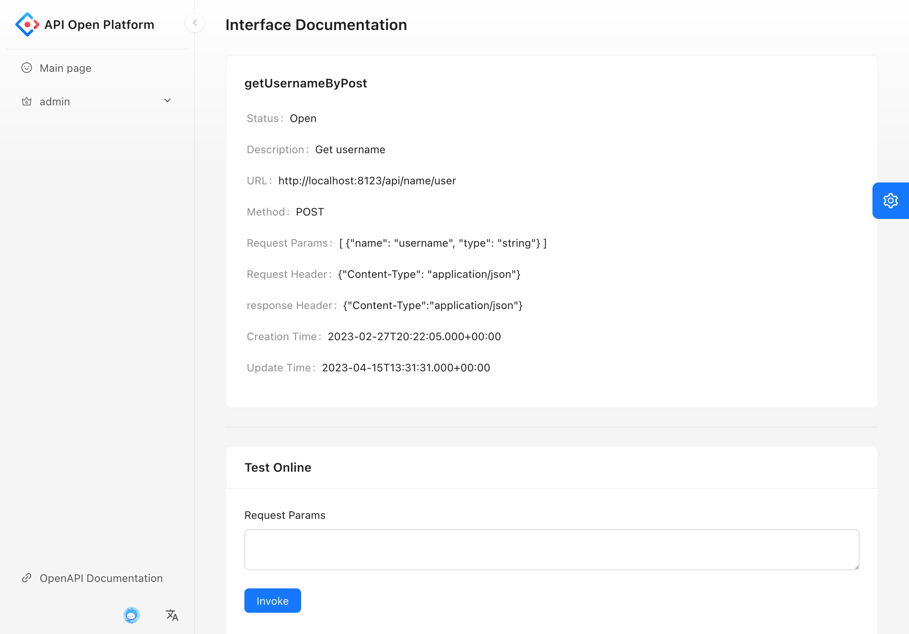
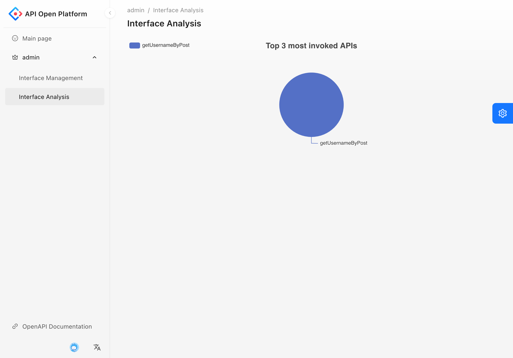

# API Open Platform (backend)

> API open platform based on React and Spring Boot that provides a centralized solution for management and utilization of APIs, with advanced features for monitoring and analysis.

Backend repository: https://github.com/RA42-y/api-platform-backend

Frontend repository: https://github.com/RA42-y/api-platform-frontend

## Features

- **Interface Access:** Users can view and invoke a variety of APIs provided on the platform, allowing them to perform various tasks and obtain information.
- **Interface Authentication:** The platform supports authentication mechanisms to ensure that only authorized users can access APIs.
- **Interface Management:** Administrators can publish, update, and take offline APIs as needed, allowing them to control the availability of resources.
- **Interface Utilization Analysis:** The platform tracks the number of API invocations made by users to help administrators monitor usage.
- **Interface Documentation:** The platform provides comprehensive documentation for each API, allowing users to easily understand their functionality and usage.

## Tech Stack

### Frontend

**Main technologies:**

- ⚛️ React 18: JavaScript library for building user interfaces.
- 🍚 Umi 4: Extensible enterprise-level front-end application framework based on React.
- 🚪 Open API: Specification for building APIs.
- 💼 TypeScript: Superset of JavaScript that provides type safety for code.

**Dependent libraries:**

- 🎨 Ant Design Pro: UI design system and React-based UI library.

### Backend

**Main technologies:**

- ☕️ Java: Popular programming language.
- 🍃 Spring Boot: Java framework for fast and easy application development.
- 🗄️ MySQL: Powerful relational database for scalable and reliable data storage.
- 🏢 MyBatis: Persistence layer framework for easy interaction with the database.
- 🚀 Dubbo RPC: High-performance, open-source RPC framework.
- 📜 Nacos: Dynamic service discovery and configuration management platform.
- 🔒 API Signature Authentication: Mechanism for authenticating API requests.
- 🚪 Spring Cloud Gateway: Gateway for building API management systems.

**Dependent libraries:**

- 🧩 MyBatis X: Configuration plugin for generating configuration files for MyBatis.
- 🗝️ Spring Boot Starter: Set of starter dependencies for Spring Boot.
- 📈 Apache Echarts: Data visualization library for building charts and graphs.
- 📚 Swagger + Knife4j: Library for organizing interface documentation.
- 🗃️ Hutool: Java library for simplifying common tasks.
- 🍬 Gson: Java library for serializing and deserializing JSON data.

## Getting Started

### Install

#### Backend

1. Clone the backend Git repository to your local machine:

    ```shell
    git clone https://github.com/RA42-y/api-platform-backend.git
    ```

##### api-client

2. Navigate to the api-client directory:

    ```shell
    cd api-platform-backend/api-client
    ```


3. Install Maven dependencies:

    ```shell
    mvn clean install
    ```

4. Build and install SDK to your local Maven repository:

    ```shell
    mvn package
    mvn install
    ```

##### api-interface

5. Navigate to the api-interface directory:

    ```shell
    cd api-platform-backend/api-interface
    ```

6. Install Maven dependencies:

    ```shell
    mvn clean install
    ```

7. Start the application:

    ```shell
    mvn spring-boot:run
    ```

    The interface will start on port `8123`.


##### api-gateway

8. Download and start Nacos service:

    - Follow the the instructions provided in [official Nacos documentation](https://nacos.io/en-us/docs/quick-start.html) to Install

    - Start the Nacos server

        ```shell
        cd nacos/bin
        sh startup.sh -m standalone
        ```

9. Navigate to the api-gateway directory:

    ```shell
    cd api-platform-backend/api-gateway
    ```

10. Install Maven dependencies:

    ```shell
    mvn clean install
    ```

11. Start the application:

     ```shell
     mvn spring-boot:run
     ```

     The gateway will start on port `8090`.

##### api-backend

12. Navigate to the backend directory:

    ```shell
    cd api-platform-backend
    ```

13. Install Maven dependencies:

    ```shell
    mvn clean install
    ```

14. Configure MySQL database:

    - Create a new MySQL database named `api`.
    - Update the MySQL connection details in the `application.yml` file located in `friend-match-backend/src/main/resources/application.yml`. Set the values for `spring.datasource.url`, `spring.datasource.username`, and `spring.datasource.password`.
    - Initialize the database with the sql file provided `sql/db.sql`.

15. Start Redis:

    ```shell
    redis-server
    ```

    If Redis is not installed, please follow the instructions provided in the [official Redis documentation](https://redis.io/topics/quickstart).

16. Start the application:

    ```shell
    mvn spring-boot:run
    ```

    The backend application will start on port `7529`. The online RESTful APIs Documentation will be on `http://localhost:7529/api/doc.html#/home`.

Congratulations! You have successfully installed and started the backend application. Now, you can proceed to set up the frontend application.

#### Frontend

17. Clone the frontend Git repository to your local machine:

    ```shell
    git clone https://github.com/RA42-y/api-platform-frontend.git
    ```

18. Navigate to the frontend directory:

    ```shell
    cd api-platform-frontend
    ```

19. Install project dependencies:

    ```shell
    npm install
    ```

20. Start the frontend application:

    ```shell
    npm run start:dev
    ```

    The frontend application will start on `http://localhost:8000`.

Congratulations! You have successfully installed and started the frontend application. Now, you can open the application in your web browser and start using it.

## Interface

### Main page

The main page is the landing page of the application and displays a list of interfaces. By clicking on an interface, users can access detailed information and test it online.




### Admin pages

#### Management

The Interface Management page enables administrators to add, modify, publish, take offline and remove APIs.


#### Analysis

The Interface Analysis page enables administrators to monitor usage of APIs.



## API

The online RESTful APIs Documentation will be on http://localhost:7529/api/doc.html#/home after the application is started.

## License

This project is licensed under the MIT License - see the [LICENSE](LICENSE.md) file for details.

